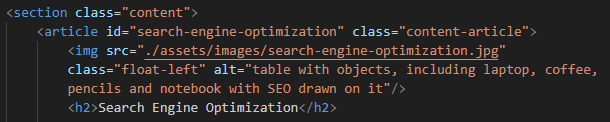
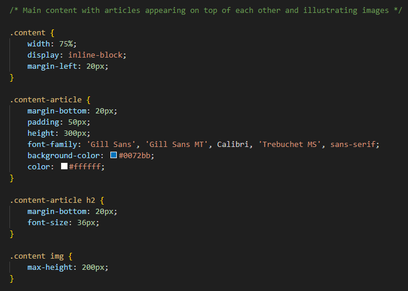
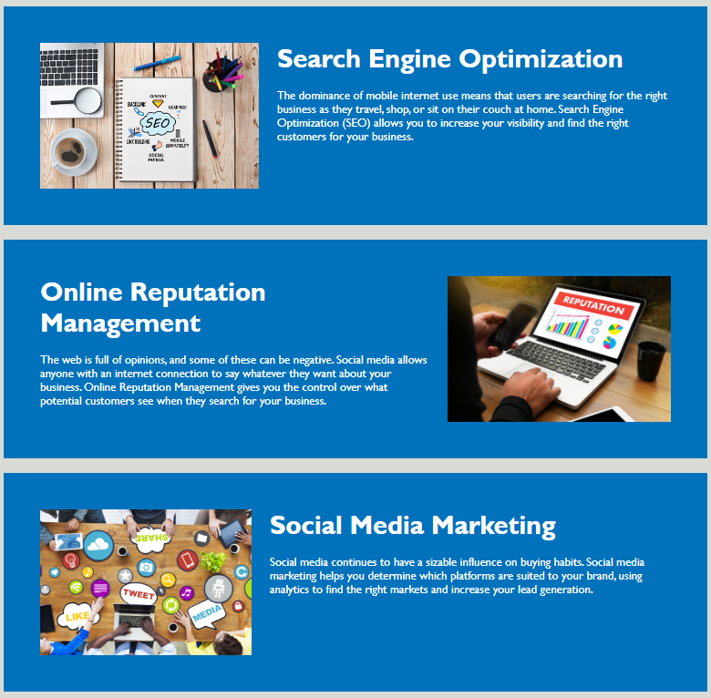

# ChallengeWeek1

This repository was created to improve the accessibility of the Horiseon website. The code was provided by edX and downloaded from the Module 1 Challenge page of the Front-End Development bootcamp. I learned to simplify code and make it more readable.

## Description

This is the Horiseon website, allowing users to find out more about its services of search engine optimization, online reputation management and social media marketing. The benefits of using this company are also outlined. Accessibility was improved by adding alt descriptions of images, semantic elements and the code was simplified and improved. Examples:

#### HTML:

---

#### CSS:

Please visit the website [here](https://jpquental90.github.io/ChallengeWeek1/)

## Table of Contents

* [Installation](#installation)
* [Usage](#usage)
* [Credits](#credits)
* [License](#license)

## Installation

N/A

## Usage

The title of the page is on the top left corner. Each section can be navigated to using the topbar menu:

When the user clicks on each link they are taken to the respective article on the page (all links are now working). This is to enable easier access to the content. There is a background image to make the website more inviting:

The content is also accessible by scrolling down the page:

 To the right side of those articles the additional benefits information can be viewed (but there isn't a direct link to it):

## Credits

Tutorials of W3Schools on semantic elements and "alt" attribute were consulted to complete this project.

## License

Licensed under the MIT license.
